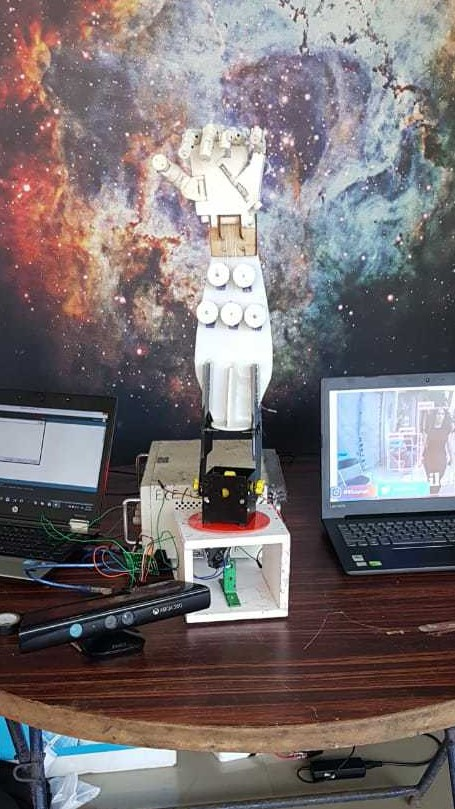
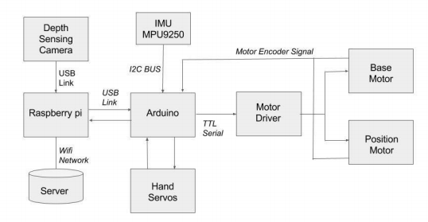

Robots have already taken over our daily life works and in near future it is expected that robots can fully perform almost any domestic tasks and assist in different operating places like restaurants, hospitals, industries ,etc.We have developed a cost effective robotic arm which works under ROS and has sensor systems for vision and tracking.The camera detects and labels the objects placed in the allowed environment and allows the user to select a particular object and perform operations like picking it up and placing it on desired
position.We use image processing algorithms and advanced decision making abilities using low computing power on the robotic arm.Using

# WORKING
Our robotic arm uses Robotic Operating System (ROS) framework over a distributed hardware platform. ROS is a software framework for robot software development which provides operating system type functionality.

We use an Arduino Mega Microcontroller to interface the motor driver and driver encoder.We also use a Raspberry Pi 3 Model B as the node-master,it runs the ROS nodes for the operation of the arm by interfacing with Arduino and depth sensor and is responsible for
registration of all ROS nodes in the network.

Our humanoid arm uses the open source software of the “You Only Look Once (YOLO)” real time object detection project.Object detection algorithms are usually trained to recognize objects from sets of features that can robustly define the objects.During the recognition phase the YOLO algorithm analyses the images globally dividing them into an SxS grid and carrying out object detection inside each cell of the grid.

# ACHIEVEMENTS
The project was selected for the KTU Tech Fest 2018. The project also bagged the first prize for the event "Symposium on Technological Innoation using AI,ML and IoT". The event was conducted by innovation hub RSC Calicut and IETE Kozhikode Sub centre.

