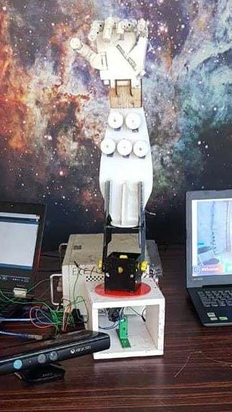

Robots have already taken over our daily life works and in near future it is expected that robots can fully perform almost any domestic tasks and assist in different operating places like restaurants, hospitals, industries ,etc.We have developed a cost effective robotic arm which works under ROS and has sensor systems for vision and tracking.The camera detects and labels the objects placed in the allowed environment and allows the user to select a particular object and perform operations like picking it up and placing it on desired
position.We use image processing algorithms and advanced decision making abilities using low computing power on the robotic arm.Using

# WORKING

# ACHIEVEMENTS
The project was selected for the KTU Tech Fest 2018. The project also bagged the first prize for the event "Symposium on Technological Innoation using AI,ML and IoT". The event was conducted by innovation hub RSC Calicut and IETE Kozhikode Sub centre.

